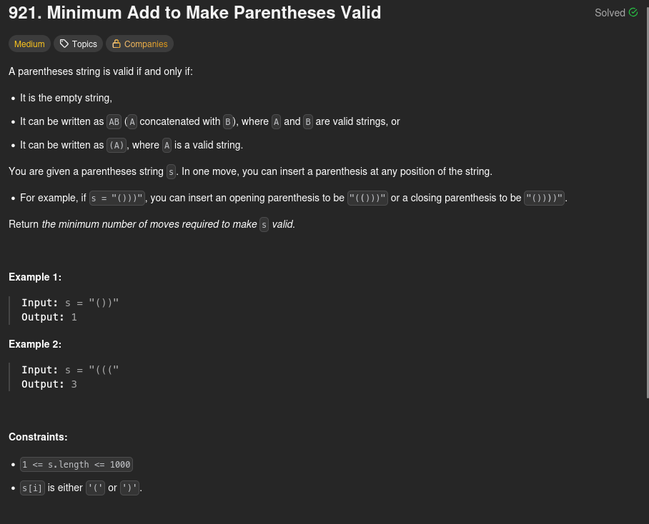

<h1>921. Minimum Add to Make Parentheses Valid</h1>

<h2>Solutions</h2>

1. [Counting '(' and ')'](./s01_counting_open_and_close_parentheses/01_CountingOpenAndCloseParentheses.md)
2. [Track Lowest Prefix Balance](./s02_track_lowest_prefix_balance/02_TrackLowestPrefixBalance.md)
