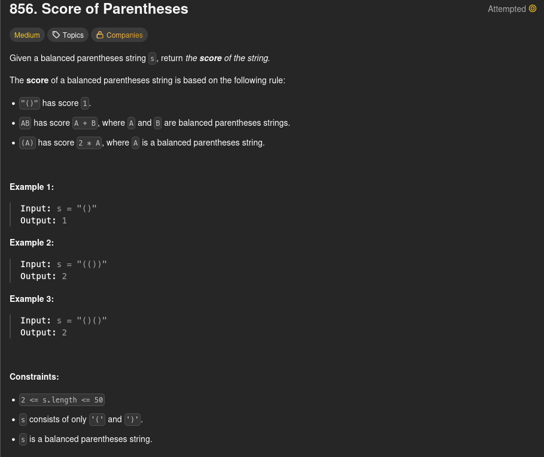

<h1>856. Score Of Parentheses</h1>



<h2>Solutions</h2>

1. [Stack recording score at each nesting level](./s01_stack_recording_score_at_each_nest_level/Solution.md)
2. [Recurse, letting each recursive call evaluate one level](./s02_recurse_letting_each_recursive_call_evaluate_one_level/Solution.md)
3. [Count depth contributions of innermost pairs](./s03_count_depth_contributions_of_innermost_pairs/Solution.md)

<h2>Commands</h2>

```python3 tests.py```

