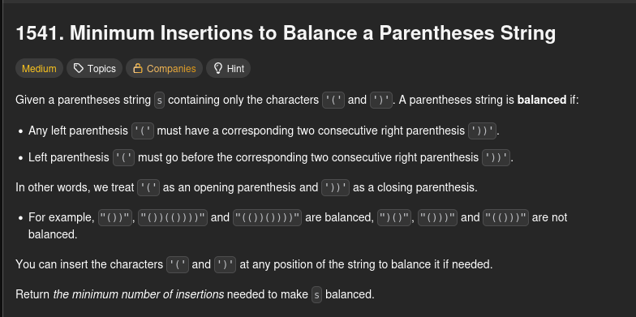
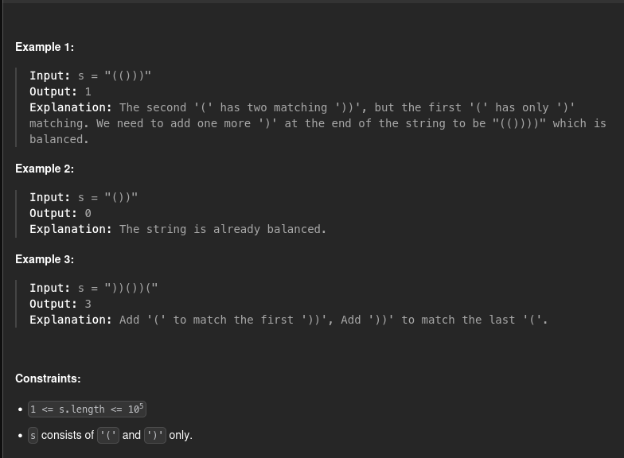

<h1>921. Minimum Add to Make Parentheses Valid</h1>




<h2>Solutions</h2>

1. [Greedy with Counter](./s01_greedy_with_counter/Solution.md)
2. [Greedy that Explicitly Comsumes '))'](./s02_greedy_that_explicitly_consumes_closing_pairs/Solution.md)

<h2>Commands</h2>
```python3 tests.py```

